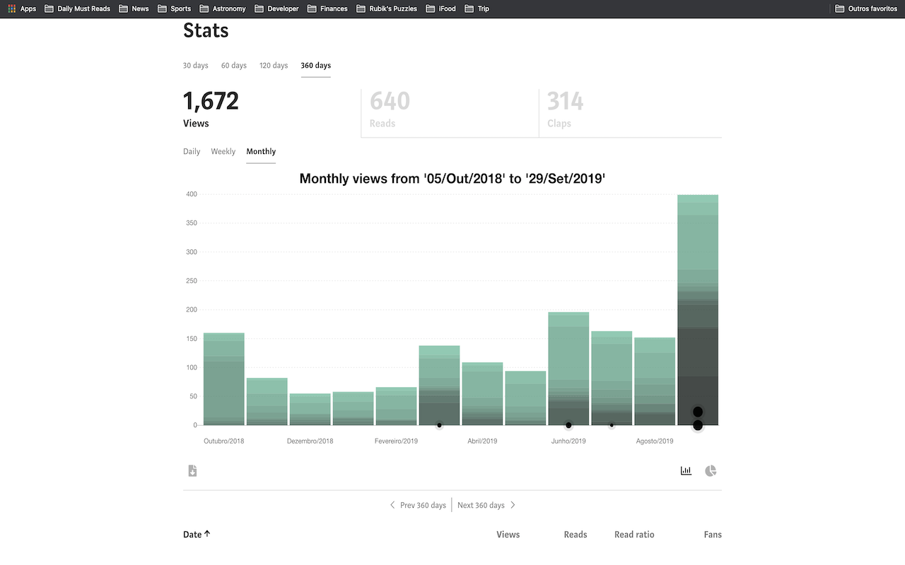

# Medium Next Generation Stats

Don't you think medium.com provides way less information that they should?
I got tired of waiting for them to make it better and decided to make it by myself.
Take your medium text stats to the Next Generation and get rid of the old fashion dataless default medium.

A [google chrome browser extension](https://chrome.google.com/webstore/detail/medium-next-generation-st/fhopcbdfcaleefngfpglahlpfhagendo) that provides richer information about your texts.

  

Get larger time range, daily/weekly/monthly read/views/claps, and, specially, describes which article was view in which period.

Have fun!

### Features
-  Highlight post/publication
-  Larger time ranges: 30/60/120/360 days.
-  Super cool and animated charts
-  Total stories views/reads/claps/earnings
-  Top articles/publications read/viewed/clapped/earned in the time range
-  Different ranges visualization: daily, weekly and monthly
-  Download JSON data file

### How to use
1. Go to your medium stats page: https://medium.com/me/stats
2. This is it

### Contact
Official website: https://virgs.me/mngs  
Medium: https://medium.com/@virgs  
Github: https://github.com/virgs  
Pagehub: https://pagehub.me/virgs  

### Source Code
You can find the source code on the link below: 
https://github.com/virgs/medium-next-gen-stats

### Development
1. Clone this repo
2. Go to chrome://extensions
3. Enable developer mode
4. Click on `load unpacked extension` and select the `medium-next-gen-stats` folder.

PRs are most welcome :)

### Acknowledgement
Thanks to [tomastrajan](https://github.com/tomastrajan/medium-enhanced-stats) and [HcwXd](https://github.com/HcwXd/better-medium-stats) for sharing their ideas and source code.   
You made my life a lot easier.
