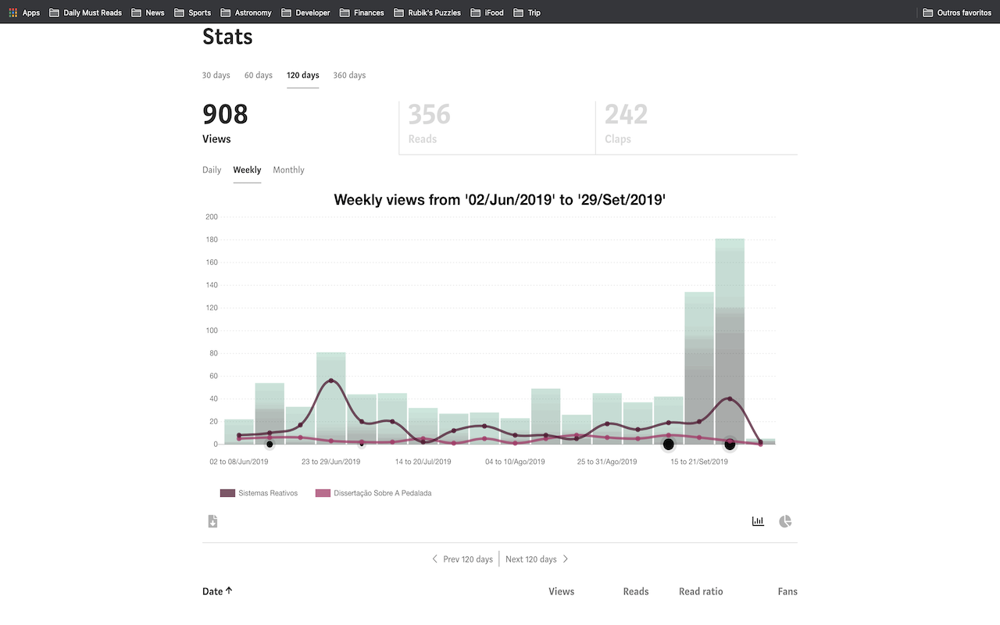

# Medium Next Generation Stats

A [google chrome browser extension](https://chrome.google.com/webstore/detail/medium-next-generation-st/fhopcbdfcaleefngfpglahlpfhagendo) that provides richer information about your texts.  

  

Get rid of the old fashion informationless default medium stats and get Next Generation Stats.

Don't you think medium.com provides way less information that they should?
I got tired of waiting for them to make it better and decided to make it by myself.

This extension provides larger time period, daily/weekly/monthly views/claps, and, specially, describes which article was view in which period.

Have fun!

### Features
-  Larger ranges
-  Super cool and animated charts
-  Total stories views/reads/claps
-  Description of top articles read in the range
-  Total in different ranges: daily, weekly and yearly

### How to use
1. Go to your medium stats page: https://medium.com/me/stats
2. This is it

### Contact
Medium: https://medium.com/@virgs  
Github: https://github.com/virgs  
Pagehub: https://pagehub.me/virgs  

### Source Code
You can find the source code on the link below: 
https://github.com/virgs/medium-next-gen-stats

### Development
1. Clone this repo
2. Go to chrome://extensions
3. Enable developer mode
4. Click on load unpacked extension and select the generated folder.

PRs are most welcome :)

### Acknowledgement
Thanks to [tomastrajan](https://github.com/tomastrajan/medium-enhanced-stats) and [HcwXd](https://github.com/HcwXd/better-medium-stats) for sharing their ideas and source code.   
You made my life a lot easier.
